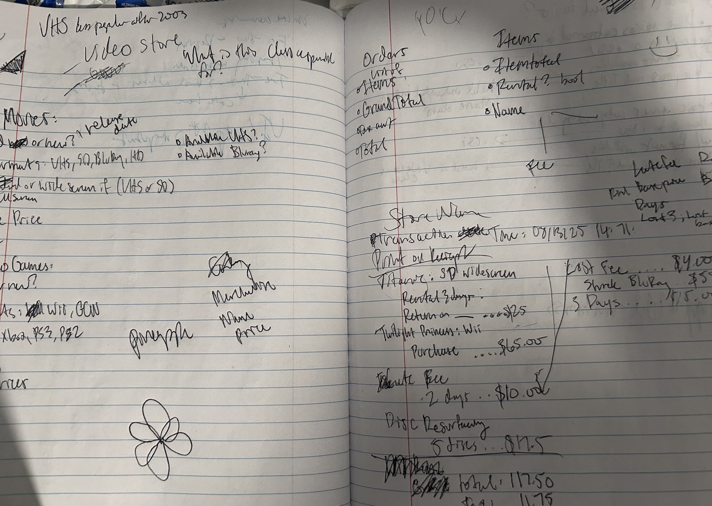
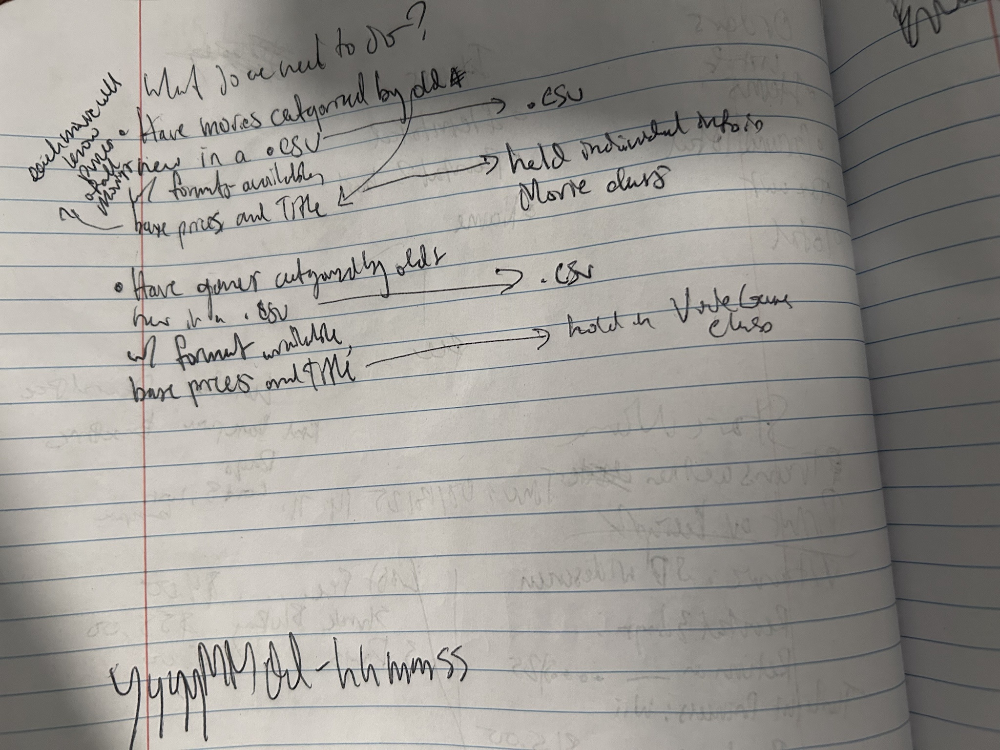
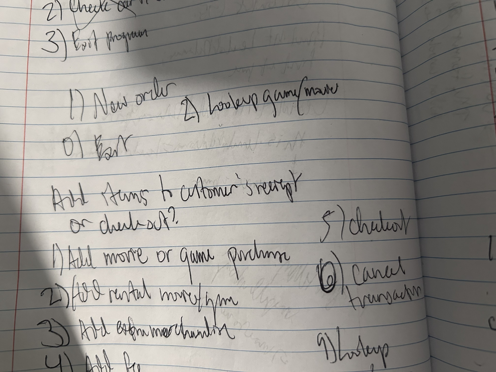
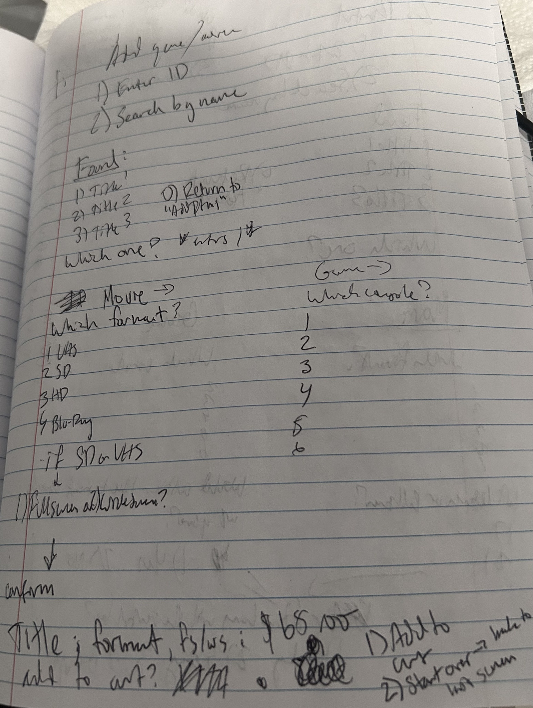
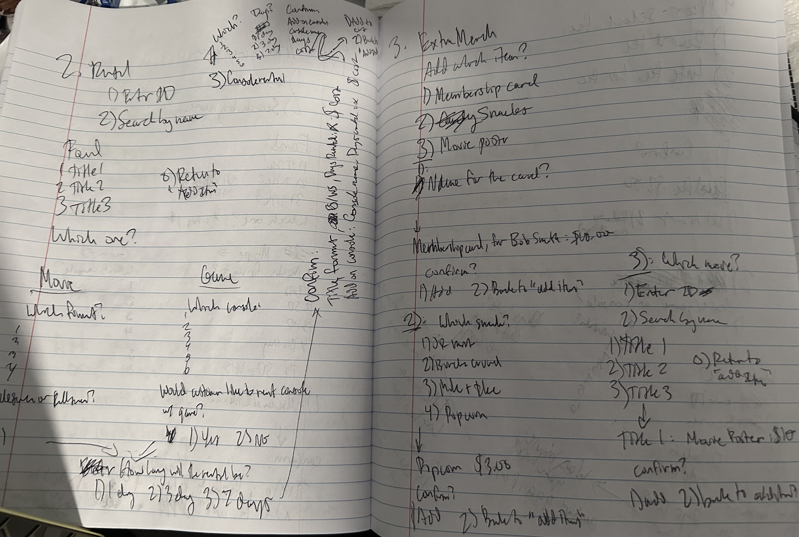

This is a project that simulates a PoS system for a 
video store stuck with movie/game choices from the year 
two-thousand-and-seven. It is written with the assumption that an 
employee would use it. 

It can only run by pulling this repository and using an IDE's terminal
at this point. 

What can the project do? 

Thus far the project can do a few things:

-Display entire movie/games list
-Calculate the price of individual items and order totals
-Have a cart that holds multiple items of various types
-Print receipts to the receipts file, at the root of this project.

Project quirks:
-Movie prices are based on format and whether or not they are new.
-Video game prices are only based on whether or not they are new. 
-Consoles can only be rented, not bought. 
-I ran out of time on this project, the scope was too big. There are
features I planned but did not have time to implement. 

It is much easier for me to think and diagram on paper so most of my
thought process is on paper.

Rough outline of my initial "class diagram": 

Adding more notes/processing:

